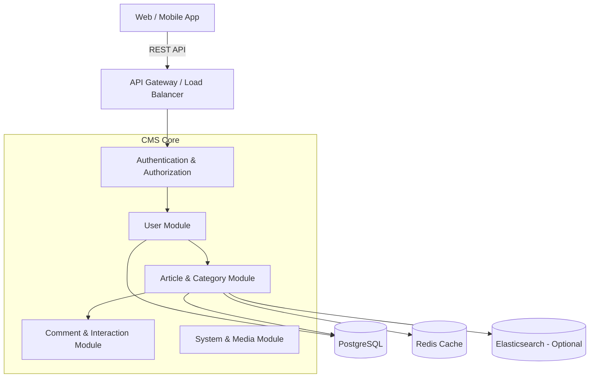
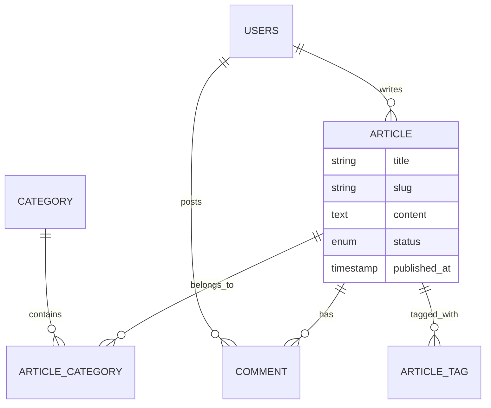

# Đặc Tả Hệ Thống Quản Lý Tin Tức & Nội Dung (News & Content CMS Specification)

**Phiên bản:** 2.0.0  
**Ngày cập nhật:** 30/11/2025  
**Trạng thái:** Production Ready  

---

## 1. Giới Thiệu (Introduction)

### 1.1 Mục Tiêu Dự Án
Xây dựng một hệ thống quản lý nội dung (CMS) chuyên nghiệp phục vụ cho các trang tin tức, tạp chí điện tử hoặc blog doanh nghiệp. Hệ thống tập trung vào quy trình biên tập bài viết, phân loại nội dung đa dạng và tối ưu hóa trải nghiệm đọc tin.

### 1.2 Phạm Vi (Scope)
-   **Core Domain:** Quản lý Bài viết (Article), Danh mục (Category), Thẻ (Tag).
-   **Editorial:** Quy trình duyệt bài (Draft -> Pending -> Published).
-   **Interaction:** Bình luận (Comment), Đánh giá (Like/React).
-   **System:** Quản lý người dùng (User), Phân quyền (RBAC), Media (File Upload).

---

## 2. Kiến Trúc Hệ Thống (System Architecture)

### 2.1 Kiến Trúc Tổng Quan
Sử dụng kiến trúc Layered Architecture với Spring Boot, sẵn sàng mở rộng.

### 2.2 Công Nghệ (Tech Stack)
-   **Backend:** Java 21, Spring Boot 3.2.
-   **Database:** PostgreSQL 15.
-   **Cache:** Redis 7.
-   **Frontend:** Next.js (React).
-   **Security:** Spring Security, JWT.

---

## 3. Thiết Kế Cơ Sở Dữ Liệu (Database Design)

Hệ thống sử dụng PostgreSQL với schema `private`.

### 3.1 Module User & Identity
-   **`users`**: Thông tin tài khoản, profile.
-   **`role`, `permission`**: Phân quyền (Admin, Editor, Reporter, User).
-   **`user_notification`**: Thông báo hệ thống.

### 3.2 Module Content (Article)
-   **`article`** (was `story`): Bảng chính lưu bài viết.
    -   `title`, `slug`, `summary`, `content` (HTML/Markdown), `thumbnail`.
    -   `status` (DRAFT, PENDING, PUBLISHED, HIDDEN).
    -   `published_at`: Thời gian xuất bản.
-   **`category`**: Danh mục bài viết (Thế giới, Công nghệ, Thể thao...).
-   **`article_category`**: Liên kết bài viết - danh mục (N-N).
-   **`article_tag`**: Thẻ bài viết (Keywords).
-   **`author`**: Thông tin tác giả (Bút danh).

### 3.3 Module Interaction
-   **`comment`**: Bình luận bài viết.
-   **`article_statistic`**: Thống kê view, like, comment.
-   **`user_favourite`**: Bài viết đã lưu/yêu thích.

### 3.4 Module System
-   **`file_upload`**: Quản lý ảnh, video đính kèm.
-   **`revinfo`, `*_aud`**: Audit log lưu vết thay đổi dữ liệu.

### 3.5 ER Diagram (Simplified)

---

## 4. Đặc Tả API (Key Endpoints)

### 4.1 Public Content
-   `GET /api/v1/articles`: Danh sách bài viết (mới nhất, theo danh mục).
-   `GET /api/v1/articles/{slug}`: Chi tiết bài viết.
-   `GET /api/v1/categories`: Danh sách danh mục.

### 4.2 Editorial (Admin/Editor)
-   `POST /api/v1/admin/articles`: Tạo bài viết mới.
-   `PUT /api/v1/admin/articles/{id}/status`: Duyệt/Xuất bản bài viết.
-   `POST /api/v1/upload`: Upload ảnh minh họa.

### 4.3 User Interaction
-   `POST /api/v1/articles/{id}/comments`: Gửi bình luận.
-   `POST /api/v1/articles/{id}/like`: Like bài viết.

---

## 5. Yêu Cầu Phi Chức Năng

1.  **SEO Friendly:** URL dạng slug, hỗ trợ meta tags.
2.  **Performance:** Page load < 1s, cache bài viết phổ biến.
3.  **Security:** Chống XSS trong nội dung bài viết, SQL Injection.
4.  **Availability:** Hệ thống hoạt động 24/7.

---
